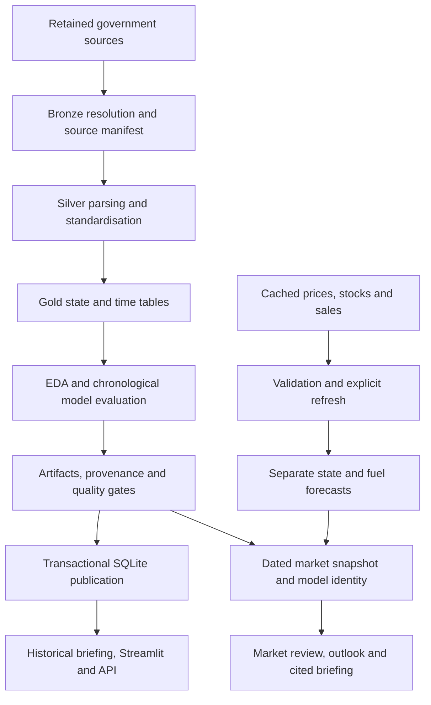

# FuelScope

**Australian fuel-market review and transport analytics**

PRT661 Data Science Practice · Charles Darwin University

FuelScope investigates how public Australian fuel and transport data can support a repeatable, evidence-based analyst review. It combines a retained historical transport analysis with a developing market workflow: dated wholesale prices, national fuel stocks, monthly state sales forecasts and source-backed briefings.

The central data science question is **whether forecasts improve on simple baselines, and whether presenting those forecasts alongside traceable market evidence helps an analyst complete a real review more accurately and efficiently**. Software engineering supports that investigation through validated inputs, reproducible outputs, organised storage and an accessible interface.

**Current release status:** the ML evaluator and its six tests are implemented on `main`. Integration is incomplete: the checked-in dashboard is the older transport view, several entry points have naming mismatches, and the complete pipeline is not yet a verified release. The instructions below distinguish what can be inspected now from what requires integration. No participant study has yet established adoption or time savings.

## Contents

- [Purpose and recurring use](#purpose-and-recurring-use)
- [Current implementation](#current-implementation)
- [Getting started](#getting-started)
- [Datasets and measurement boundaries](#datasets-and-measurement-boundaries)
- [Architecture and repository structure](#architecture-and-repository-structure)
- [Data science methodology](#data-science-methodology)
- [Outputs and reproducibility](#outputs-and-reproducibility)
- [Verification and integration checklist](#verification-and-integration-checklist)
- [API and configuration](#api-and-configuration)
- [Limitations and responsible interpretation](#limitations-and-responsible-interpretation)
- [Assessment 4 research and development](#assessment-4-research-and-development)
- [Assessment 3 demonstration and contributions](#assessment-3-demonstration-and-contributions)
- [Troubleshooting](#troubleshooting)

## Purpose and recurring use

The intended user is an energy, industry or government analyst who monitors the fuel market and prepares a regular briefing. Prices, sales, stocks and inventories arrive at different frequencies, use different units and cover different boundaries. A useful review must preserve those distinctions and make its claims checkable.

| Frequency | Analyst task | Intended benefit |
|---|---|---|
| Working days | Inspect dated changes in a selected capital-city terminal price and check source freshness | Identify evidence worth investigating without collecting the same source manually each day |
| Weekly | Compare national holdings with the effective stockholding obligation and review changes since the previous visit | Produce a consistent market briefing with explicit dates, scope and references |
| Monthly, when sales arrive | Inspect the state/fuel outlook, baseline comparison and uncertainty | Judge whether a forecast is useful for a planning discussion |
| When inventories are released | Examine official transport inventories and per-person comparisons | Add historical context without treating annual data as a live market signal |

The market interface source includes notes, review checkpoints and exports for continuity between visits. These are part of the workflow being integrated; they do not prove that professional users already rely on FuelScope. The [prospective analyst pilot](docs/evaluation/market_review_pilot.md) defines how benefit will be measured.

## Current implementation

This status describes `main` after the [ML-only integration commit](https://github.com/xhhetri/Data_Practice_Project/commit/c717dd2799334ce5dba5e5526b9390bbacfacf3e), checked on 7 October 2026.

| Component | Evidence in this checkout | Status |
|---|---|---|
| Chronological forecasting and annual regression | [Model](src/analysis/model.py), [forecast tests](tests/test_forecasting.py) | Six ML tests pass, including holdout separation and notebook compatibility |
| Historical sources and processed tables | [Bronze manifest](data/bronze/_manifest.csv), `data/processed/` | Retained snapshots are inspectable; current rebuilding has a fleet-loader integration problem |
| Recurring market inputs | [Market manifest](data/market/source_manifest.json), `data/market/raw/` | Three cached workbooks and source records are present |
| Market validation and forecast orchestration | [Market module](src/market_review.py), [refresh module](scripts/refresh_market.py) | Component code exists; a complete release requires a historical run and working build entry points |
| Saved dashboard | [HTML](dashboard/index.html), `dashboard/plotly.min.js` | Older transport snapshot, not the generated daily/weekly market view |
| Daily/weekly interface | [Market template](dashboard/market_template.html), [builder](scipts/build_market_dashboard.py) | Source exists; the completed market snapshot is absent |
| Streamlit, API and database serving | [Streamlit source](app/stramlit_app.py), [API](app/api.py), [snapshot reader](src/serving.py) | Require a matching database run; documented/tested entry-point names need alignment |
| CI | [GitHub Actions](.github/workflows/ci.yml) | Configured; local tests do not establish a successful current remote run |

Historical logs and saved metrics describe earlier builds. They do not establish that the current code, database, figures and dashboard form one matching release. In particular, `reports/model_results/metrics.json` retains older results and must be regenerated before claiming it evaluates the current chronological model.

## Getting started

### 1. Create the environment

Use **Python 3.12** and run commands from the repository root. Git and internet access are needed to clone and install dependencies; retained files can then be inspected locally. Node.js is needed only for the optional executable dashboard checks, which use its built-in modules.

```text
git clone https://github.com/xhhetri/Data_Practice_Project.git
cd Data_Practice_Project
```

Windows PowerShell:

```powershell
py -3.12 -m venv .venv
.\.venv\Scripts\python.exe -m pip install -r requirements-lock.txt
```

macOS or Linux:

```bash
python3.12 -m venv .venv
.venv/bin/python -m pip install -r requirements-lock.txt
```

[requirements-lock.txt](requirements-lock.txt) pins the recorded environment; [requirements.txt](requirements.txt) defines broader ranges. Use the lock for reproduction and verify dependency changes. The local `.venv` is not part of the repository.

### 2. Verify the ML component

Windows:

```powershell
.\.venv\Scripts\python.exe -m pytest tests/test_forecasting.py -q -p no:cacheprovider
```

macOS or Linux:

```bash
.venv/bin/python -m pytest tests/test_forecasting.py -q -p no:cacheprovider
```

The verified result on 7 October 2026 is **6 passed**. Disabling pytest's optional results cache avoids reusing a cache owned by another Windows account. Optimiser warnings can occur on synthetic seasonal data; non-converged candidates are rejected, with seasonal naive available as the fallback.

### 3. Inspect the saved dashboard

Keep `dashboard/index.html` beside `dashboard/plotly.min.js`. Open the HTML directly or serve it locally:

```powershell
.\.venv\Scripts\python.exe -m http.server 8765 --bind 127.0.0.1 --directory dashboard
```

Open **http://127.0.0.1:8765/**. On macOS/Linux, use `.venv/bin/python`. Stop the server with **Ctrl+C**.

This opens the retained transport dashboard. Its historical charts are a saved snapshot; they do not prove a fresh pipeline run or current forecast accuracy.

### 4. Review service and full build

The review-server file currently lives under the misspelled `scipts/` directory. Inspect its actual CLI with:

```powershell
.\.venv\Scripts\python.exe -m scipts.serve_review --help
```

Starting that module with `--port 8766` serves the existing dashboard and local service routes. It does **not** supply the missing market snapshot or repair refresh/build imports. `Start-FuelScope.cmd` is absent from this `main` checkout.

After resolving the [integration checklist](#verification-and-integration-checklist), the intended release command is:

```powershell
.\.venv\Scripts\python.exe run_pipeline.py
```

Require a successful completion message and matching output identities. Partially written files from a failed build are not a completed release. Once the canonical server path and market dashboard are integrated, the intended daily/weekly launch is:

```powershell
.\.venv\Scripts\python.exe -m scripts.serve_review --port 8766
```

[GUIDE.md](GUIDE.md) and the [FuelScope runbook](docs/assessment3/fuelscope_video_runbook.md) describe the integrated workflow. Some paths there precede the partial merge; this README's current-status table and checklist take precedence for this checkout.

## Datasets and measurement boundaries

### Historical transport data

Six government files are recorded in the Bronze manifest. One BITRE workbook supports multiple logical datasets.

| Source | Analytical use | Boundary |
|---|---|---|
| [Australian Petroleum Statistics](https://www.energy.gov.au/energy-data/australian-petroleum-statistics) | Monthly gasoline and total diesel sales; combined monthly and annual activity | Total diesel includes non-road uses; recorded sales are not measured road-only consumption |
| [State and territory inventories](https://www.dcceew.gov.au/climate-change/publications/national-greenhouse-accounts/state-and-territory-greenhouse-gas-inventories-data-tables-methodology) | Official financial-year transport inventory | The selected sector covers all transport modes |
| [BITRE Yearbook](https://www.bitre.gov.au/sites/default/files/documents/bitre-yearbook-2025.pdf) | Road VKT, Table 4.3; intended historical stock input, Table 4.6b | Stock uses published calendar years; matching the year to the financial year starting then is approximate |
| [ABS population](https://www.abs.gov.au/statistics/people/population/national-state-and-territory-population/latest-release) | Population means and per-person measures | Each included state/year requires four unique positive quarterly observations |
| [Quarterly national inventories](https://www.dcceew.gov.au/climate-change/publications/national-greenhouse-gas-inventory-quarterly-updates) | Retained national context | National observations do not replace state financial-year totals |
| [National Greenhouse Accounts Factors](https://www.dcceew.gov.au/climate-change/publications/national-greenhouse-accounts-factors-2025) | Fuel-times-factor comparison | A combustion-factor diagnostic is not a validated replacement for the official inventory |

The retained annual CSV has **98 state/year rows**, covering **FY2010–11 to FY2023–24**. The combined-sales monthly CSV has **1,344 rows**, covering **July 2010 to June 2026**. These counts describe saved tables, not successful regeneration by the current loaders. An auxiliary NSW hourly traffic table is retained but is not a current forecasting predictor.

The seven supported jurisdictions are **NSW, NT, QLD, SA, TAS, VIC and WA**. ACT is excluded because the selected sales source does not provide its own ACT series.

### Recurring market evidence

The following values come from the checked-in manifest. They describe that snapshot, not live availability or a refresh performed today.

| Source | Observation cutoff | Recorded parsed rows | Scope |
|---|---|---:|---|
| [AIP terminal gate prices](https://aip.com.au/resources/historical-ulp-and-diesel-tgp-data/) | 2 October 2026 | 94,992 | Wholesale terminal prices by city/fuel, including GST; not retail pump prices |
| [DCCEEW MSO statistics](https://www.dcceew.gov.au/energy/security/australias-fuel-security/minimum-stockholding-obligation/statistics) | 22 September 2026 | 93 | National dated product observations for holdings, effective obligations and days equivalent |
| [APS July extract](https://www.energy.gov.au/publications/australian-petroleum-statistics-2026) | July 2026 | 2,702 | Separate state petrol/diesel sales and additional national supply context |

Observed-through dates, retrieval times and check times answer different questions. Downloading a workbook recently does not make its observations recent. Original Bronze retrieval dates were not recorded; file modification time cannot prove when the original download occurred. Source URLs and boundaries are centralised in [src/catalog.py](src/catalog.py).

### Units and grain

| Measure | One observation | Unit |
|---|---|---|
| Terminal price | Date × city/terminal × fuel | cents/L, including GST |
| Monthly sales | Month × state, or month × state × fuel | ML, meaning megalitres |
| MSO stocks | Observation date × fuel, national | ML and separately defined days equivalent |
| Official inventory | Financial year × state | kt CO2-e |
| Road travel | Financial year × state | million vehicle-kilometres |
| Historical vehicle stock | Published year × state | vehicles |
| Population | Quarter × state; averaged within the financial year | persons |

In annual tables, `year=2023` means **FY2023–24**. The legacy `fuel_consumption_ml` field represents combined petrol and total diesel **sales**. Per-person inventory is `ghg_kt_co2e × 1,000,000 / population`.

## Architecture and repository structure

The diagram describes the component design. The complete path awaits the integration fixes below.



The intended [pipeline](run_pipeline.py) cleans sources, creates EDA, evaluates models, records the signed diagnostic, binds provenance, checks quality/drift, publishes SQLite, builds market evidence and generates interfaces, diagrams and reports.

Market refresh is explicit rather than scheduled on page load. The component logic discovers official workbook links, downloads a temporary file, validates it and atomically replaces the cache after acceptance. Invalid or older downloads retain the previous file; matching checksums produce an unchanged result. Completing refresh also requires the snapshot and dashboard stages to be integrated.

| Location | Responsibility |
|---|---|
| `src/analysis/` | Bronze/Silver/Gold processing, orchestration, EDA, models and diagnostic |
| `src/market_review.py` | Market parsing, cached evidence and separate-product outlooks |
| `src/briefing.py`, `src/serving.py` | Shared briefing calculations and consistent database reads |
| `src/provenance.py`, `src/db.py` | Artifact identities and transactional publication |
| `scripts/`, `scipts/` | Current split entry points; naming integration is outstanding |
| `app/`, `dashboard/` | Streamlit/API source, HTML templates and saved interface |
| `data/`, `reports/` | Raw/processed data, warehouse and retained/generated evidence |
| `monitoring/`, `tests/` | Structural quality, freshness, descriptive drift and verification |
| `docs/`, `.github/workflows/` | Designs, evaluation protocols, assessment guides and CI |

## Data science methodology

### Monthly fuel-sales forecasts

[evaluate_fuel_series](src/analysis/model.py) compares **seasonal naive**, which repeats the latest observed 12-month season, with **additive Holt-Winters**, which estimates level, trend and annual seasonality.

The default horizon is six months. Inputs must be unique, consecutive month-start observations with finite positive values. Prediction requires at least 24 observations; rolling evaluation needs additional history sufficient for at least three earlier test windows.

The evaluator:

1. Reserves the final six observed months as the final holdout.
2. Evaluates candidates on earlier expanding windows, starting with 60 training months.
3. Selects the lower earlier-window MAPE; ties after rounding to two decimal places favour seasonal naive.
4. Evaluates the selected candidate and baseline on the same untouched final holdout.
5. Refits on all observations and predicts beyond the source cutoff.

The retained combined-sales function uses six-month origin steps. The market module evaluates **14 state/fuel series** with three-month steps; the July extract supports **41 earlier origins per series**. These settings are in the code; current release results must be generated and verified before reporting their errors.

**MAE** is average absolute error in megalitres. **MAPE** is average absolute error relative to observed sales, expressed as a percentage. Earlier-window selection cannot guarantee that the model beats the baseline on the later holdout.

Approximate 80% and 95% bands use horizon-specific quantiles of earlier absolute forecast errors. Final-holdout coverage is recorded. Six final observations make coverage coarse; overlapping windows, revised extracts and future shocks limit interpretation. The labels do not establish calibrated future probabilities. Forecast months start after the source cutoff and may already have elapsed when an older release is viewed.

### Annual transport-inventory regression

Linear regression and random forest use expanding **whole-year** folds, with previous-year inventory as a reference. Inputs are contemporaneous fuel sales, road VKT and stock. Results include pooled and per-state errors; the selected artifact records feature names and observed ranges.

This is **associative analysis**, not an operational forecast of future emissions. Same-year activity inputs are more informative than a previous-year-only benchmark, so this is not an equal-information forecasting contest. High pooled R² can reflect state size and accounting relationships. The models do not establish causal policy effects.

### EDA and reconciliation

EDA examines distributions, changes, correlations and per-person comparisons. The signed fuel-times-factor diagnostic preserves discrepancies with official inventory values. Its boundary remains unresolved: total diesel sales, combustion factors and whole-transport totals describe different activities. Official inventories remain the reporting reference.

Prices and stocks currently supply **review context**, not additional predictive features. Review markers are descriptive rules, not a trained shortage/anomaly classifier. The original anomaly-detection proposal should not be described as delivered by these models.

## Outputs and reproducibility

| Artifact | Location | Interpretation |
|---|---|---|
| Historical source record | [Bronze manifest](data/bronze/_manifest.csv) | Selection, SHA256, sample/real status, URL and boundary |
| Market source record | [Market manifest](data/market/source_manifest.json) | Workbook identities, cutoffs and recorded checks |
| Analytical CSVs | `data/processed/` | Annual, population-adjusted and combined monthly tables |
| Warehouse | `data/gold/warehouse.sqlite` | Serving requires matching structured results and metadata |
| Model results | `reports/model_results/metrics.json` | Retained values predate the integrated evaluator |
| Fitted artifact | `reports/model_results/emissions_regression.pkl` | Rebuild with current code and matched metadata |
| Plots and diagnostic | `reports/figures/`, `reports/validation/` | Build outputs rather than independent validation |
| Historical dashboard | [dashboard/index.html](dashboard/index.html) | Existing saved transport view |
| Release metadata | `reports/run_metadata.json` | Generated identities, hashes, versions and coverage; absent until a completed build |
| Market evidence | `reports/market_review/snapshot.json`, `sales_models.json`, `technical_results.md` | Generated forecasts and source context; absent in this checkout |

Provenance binds the release to source hashes, relevant code and the dependency lock. Database publication verifies hashes, structural quality and run identities, then writes analytical tables, flattened metrics, full results, metadata and an audit record transactionally. Serving reads one consistent snapshot.

Retain the exact commit, environment, source workbooks/manifests, complete build log, evaluation windows, generated metrics and briefing exports. Rebuild connected artifacts together instead of editing hashes or copying one result into an older release. Market evidence has separate evidence/model identities and a reference to the historical run.

## Verification and integration checklist

The 7 October ML integration check recorded **6 ML tests passed** and **44 passed / 13 failed** for the wider `main` suite. Failures involved app/script paths, fleet handling and missing pipeline metadata outside the two ML files. Earlier logs with other totals belong to earlier builds, not a current all-tests-passed release.

Resolve these issues before demonstrating a successful complete build:

| Current path or issue | Required integration |
|---|---|
| `scipts/build_dashboard.py` | Align with `scripts/build_dashboard.py` imports |
| `scipts/build_market_dashboard.py` | Align with `scripts/build_market_dashboard.py` refresh imports |
| `scipts/build_evidece.py` | Align with `scripts/build_evidence.py` imports |
| `scripts/gernerate_diagrams.py` | Align with `scripts/generate_diagrams.py` imports |
| `scipts/serve_review.py` | Align with `scripts/serve_review.py` documentation/tests |
| `app/stramlit_app.py` | Align with `app/streamlit_app.py` documentation/tests |
| Fleet loader returns `year_of_manufacture` | Supply historical stock with a valid published-year key for Gold/readiness |
| Missing completed metadata and market snapshot | Rebuild the validated pipeline, outputs, warehouse and interfaces as one release |
| Older documentation advertises a launcher | Restore and verify it if offering one-click Windows startup |

After integration, run the complete suite:

```powershell
.\.venv\Scripts\python.exe -m pytest tests/ -q -p no:cacheprovider
```

Dashboard checks, requiring the corresponding generated release:

```text
node tests/check_dashboard_exports.mjs
node tests/check_market_dashboard.mjs
```

ML tests cover seasonal predictions, invalid series, holdout chronology, future dates, interval ordering, the notebook figure interface and JSON-safe metrics. Wider checks cover source completeness, population quarters, database publication, briefings, local requests and app behaviour.

[CI](.github/workflows/ci.yml) currently runs tests before the full pipeline, then monitoring and artifact upload. Some tests require completed pipeline evidence; cross-platform artifact bytes can also differ. Release ordering and Linux reproduction need verification. Add a success badge or claim a remote passing run only with actual run evidence.

## API and configuration

SQLite is the default; it needs no `.env`. Copy [.env.example](.env.example) only for custom settings. PostgreSQL needs a compatible driver and separate verification. Redshift concepts inform coursework, but a project deployment on Redshift has not been demonstrated.

Once a matching database release exists:

```powershell
.\.venv\Scripts\python.exe -m uvicorn app.api:app --host 127.0.0.1 --port 8000
```

Open **http://127.0.0.1:8000/docs**. HTTP 503 indicates an unavailable release/database snapshot.

| Route | Purpose |
|---|---|
| `GET /health` | Readiness, identity and coverage |
| `GET /states` | Available jurisdictions |
| `GET /briefing` | State/financial-year summary and cited Markdown |
| `GET /forecast/{state}` | Stored combined-sales forecast and evaluation |
| `GET /provenance` | Source/run metadata |
| `GET /metrics` | Flattened metrics, optionally filtered by result group |
| `GET /monitoring/drift` | Matching-run descriptive drift and quality |
| `POST /predict` | Associative annual estimate using positive finite inputs within recorded ranges |

The review server separately defines `GET /api/status`, `GET /api/review` and explicit `POST /api/refresh`. API state forecasts and market separate-product forecasts are distinct.

Keep demonstrated services on loopback. Environment port variables do not override explicit launch arguments automatically. Do not commit credentials in `.env`; load pickle artifacts only from trusted builds. Public hosting, authentication and cloud operations require further implementation and verification.

## Limitations and responsible interpretation

- **Geography:** city terminal prices, state sales and national stocks describe different units.
- **Activity:** total diesel includes non-road uses; the inventory includes all transport modes.
- **Timing:** sources have different publication lags; historical sales publication vintages are not reconstructed.
- **Stocks:** days equivalent is not a countdown to local shortage; effective obligations can change.
- **Uncertainty:** overlapping windows and a small holdout do not establish future calibration.
- **Causality:** descriptive movements, regression and per-person rankings do not establish policy success.
- **Drift:** pooled KS checks are descriptive; `no_drift` proves neither correct data nor accurate models.
- **Usability:** market-template notes/checkpoints are browser-local, not shared team approvals.
- **Evidence:** saved metrics, screenshots and logs must match the code/sources that produced them.

Cite original publishers and check dataset reuse terms. This repository currently has no software `LICENSE` file; public availability does not establish an open-source licence. The core government sources are aggregate observations, not driver records. Keep private credentials and personal assessment evidence out of public commits.

## Assessment 4 research and development

1. **Complete integration:** align entry points and fleet handling; produce a reproducible, passing release and actual remote CI evidence.
2. **Evaluate data availability:** document predictor publication timing and reconstruct historical vintages where feasible.
3. **Test added predictors:** compare properly lagged price/supply variables with history-only baselines on the same holdouts.
4. **Examine uncertainty:** evaluate error and band coverage by horizon/jurisdiction across more test periods.
5. **Evaluate real use:** recruit three to five analysts for a counterbalanced, matched-evidence comparison with their actual workflow, then observe four real weekly cycles.

Measure review time, factual/interpretation errors, traceability, voluntary return and briefing use. Record unchanged weeks, stale feeds and reasons users stop returning. Mandatory student visits are not adoption evidence. The [pilot](docs/evaluation/market_review_pilot.md) remains prospective; no savings or participant results are claimed.

## Assessment 3 demonstration and contributions

Explain objectives, updated architecture, workflow, implementation, model evaluation, technical challenges and future development. Establish progress against the actual Assessment 2 submission using verifiable before/after evidence.

| Role area | Evidence to explain |
|---|---|
| Project lead and architecture | User task, scope, architecture, integration decisions and next milestone |
| Data engineering | Source identity/dates, validation, retention and failed-update handling |
| Data modelling and analysis | Grain, units, financial-year alignment, joins and interpretation |
| Machine learning | Baselines, chronological testing, errors, uncertainty and reproducible experiments |
| Visualisation and DevOps | Actual user journey, exports, repeatability and verified operations |

Use the [FuelScope runbook](docs/assessment3/fuelscope_video_runbook.md), [transport runbook](docs/assessment3/demo_runbook.md) and [contribution guide](docs/assessment3/contribution_evidence_guide.md), checking them against the actual recording release. The [v2 presentation](docs/assessment3/presentation/PRT661_Technical_Demonstration_v2.pptx) covers an earlier scope.

The video is **at most 20 minutes**. The combined individual contribution PDF requires **exactly two pages per student**, minimum font size 10. Each second page needs one genuine specified Redshift Lab 2 screenshot showing the lab name, mark and completion date/time, plus reflection. Role allocation and shared code do not prove personal authorship; supply actual commits, task records, experiments and checks.

## Troubleshooting

| Symptom | Cause and action |
|---|---|
| Missing `scripts.serve_review` or `build_dashboard` import | Entry-point mismatch; review the checklist. The actual current server CLI is under `scipts` |
| Missing `Start-FuelScope.cmd` | Launcher absent; inspect the saved dashboard until it is restored/verified |
| Historical fleet stock error | Silver/Gold contract mismatch; manufacture year cannot replace observation year |
| API 503 or Streamlit data unavailable | No complete matching snapshot; finish integration and rebuild |
| Artifact changed after the run | Hash mismatch after regeneration or cross-platform byte changes; rebuild rather than hand-edit hashes |
| Pytest access denied under `.pytest_tmp` | Shared fixed temp directory may be owned by another account; remove that configuration or choose a fresh user-owned location |
| `PytestCacheWarning` | Disable the optional cache with `-p no:cacheprovider`; distinguish it from test failures |
| Optimiser warning | Check candidate status and fallback; rejection does not mean the candidate's forecast was accepted |
| Busy port | Choose a free explicit port or stop your previous server |
| Source check succeeds but dates stay old | Distinguish unchanged, failed and updated evidence using the observation cutoff/status |

Use focused commits and pull requests stating the problem, change, verification and limitations. Preserve source attribution, link substantial contributions to evidence, and update this README's status when integration or verification changes.
