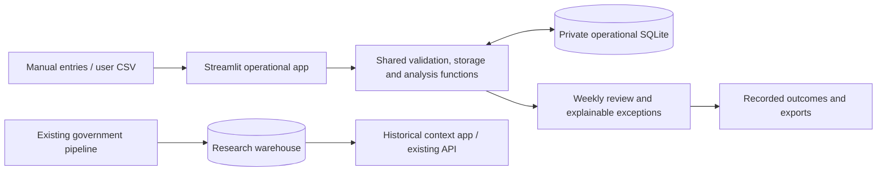

# Fleet Fuel Review: daily records and weekly decisions

Date: 4 October 2026. Status: proposed architecture for user review; not implemented.

## Purpose and assumptions

The user requires genuine daily or weekly usefulness, accepts substantial project changes and additional datasets, and currently has no recruited end user. This design adopts the strongest candidate from the preceding brainstorm: fuel-cost review for an individual vehicle owner or a small organisation with several vehicles.

The core task is: **record actual fuel activity, review weekly spending, investigate explainable exceptions, and retain the outcome.** New receipts and completed reviews create the reason to return. Historical state emissions remain supporting research context.

This is a proposed audience and task, not validated demand. The working application must support genuine user records immediately. Repeated adoption, time savings, corrected records and financial outcomes require subsequent real observations. No synthetic demonstration will be described as evidence of benefit.

## Alternatives considered

1. **Operational fuel review — selected.** Direct weekly task, self-supplied fresh data, measurable review outcomes and substantial reuse of existing Python/storage/analysis skills. Main dependency: willing users with usable records.
2. **Public-price refuelling assistant.** More immediately accessible to consumers, but regional feeds and API access need verification, and existing FuelCheck already provides route searches, alerts and trends. A generic map would have little additional value.
3. **Commute reliability assistant.** A daily decision, but requires transport feeds and historical observations, changes the project's analytical subject and reuses less of its current work.

## First operational release

The application supports one local workspace, one or more vehicles, AUD, litres and kilometres. It uses the existing Python environment and Streamlit. The private records database is separate from the government-data warehouse and survives analytical pipeline rebuilds.

The release includes vehicle setup, manual purchase entry, CSV preview/import, record correction with history, weekly cost review, explainable exception review, scenario estimates, and downloadable records/reports/backup. It does not require live fuel-price credentials to complete its primary workflow. A visibly separate demonstration workspace provides fictional practice records; the real workspace starts empty.

The product does not infer fuel theft, diagnose mechanical faults, score employees, recommend transport policies or calculate tax. It identifies records and changes that deserve human review.

## Daily workflow

1. Select a vehicle. Create it once with a nickname, fuel grade and optional tank capacity.
2. Record a fuel purchase: date/time, litres, total paid, optional odometer, tank status (full/partial/unknown), and optional receipt reference/vendor/note.
3. Save once and receive a clear success message. Repeat submissions with the same request identifier are idempotent.
4. Alternatively, upload an existing fuel-card or spreadsheet CSV, map its columns, inspect parsed rows/errors/likely duplicates, and confirm import. Nothing is written during preview.
5. Correct a mistake from transaction history; retain the previous version. Voiding a record is reversible. Recompute affected analysis from active records.

The interface remembers the selected vehicle and common fields. Data entry remains short; no GPS, account integration or attachment is required. Users can log transactions as they occur or import them weekly.

## Weekly workflow

Choose a Monday–Sunday week and either one vehicle or the workspace. Show:

- Total fuel spending, litres purchased, receipt count and volume-weighted paid price per litre.
- The same-period comparison with the previous week, including an explicit partial-week label for an ongoing week and matching elapsed days when comparing it.
- A spending-change explanation separating purchase volume and paid price. Purchase volume is labelled as purchased fuel, not measured weekly consumption or distance driven.
- Valid full-to-full efficiency intervals, with their actual start/end dates and supporting receipts. Intervals crossing week boundaries are not silently allocated to a week.
- A short exception list, each with the evidence, rule/baseline used, limitations and a record link.
- Open review actions and previously recorded outcomes.

Review outcomes are `open`, `explained`, `record corrected`, or `follow-up needed`, with an optional note. A confirmed refund may be entered by the user with supporting reference; the app does not turn a flagged amount into claimed savings.

The weekly report contains the period, totals, completeness warnings, exceptions and review outcomes. Users can save the report and return next week to continue reviewing new records.

## Analysis rules

### Money and spending changes

Store amounts as integer cents; parse decimal inputs explicitly and reject non-finite, zero or negative purchase amounts/volumes. Use decimal arithmetic where conversion or rounding occurs. Preserve the entered total as the financial record; derived unit price is informational.

For two comparable periods with positive volumes, spending is `volume × volume-weighted unit price`. Use a symmetric decomposition:

`volume contribution = (V1 - V0) × (P1 + P0) / 2`

`price contribution = (P1 - P0) × (V1 + V0) / 2`

The two contributions sum to the spending difference before display rounding. Where a period has no purchases, show the raw difference and explain that decomposition is unavailable. Grade changes and incomplete imports are visible limitations.

### Efficiency

Use a confirmed-full purchase as the opening boundary and the next confirmed-full purchase with a higher odometer as the closing boundary. Sum recorded litres after the opening boundary through and including the closing boundary, including intermediate partial purchases. Exclude the opening purchase's litres.

`L/100 km = interval litres / (closing odometer - opening odometer) × 100`

Unknown odometers do not prevent spending review. Efficiency is unavailable when endpoints are missing, order is ambiguous, readings conflict, or the user indicates purchases are missing. No distance or tank level is invented. Display that efficiency assumes the supplied interval contains every purchase and comparable full-tank boundaries.

### Exceptions

Data-quality rules identify likely duplicate receipts, repeated references, inconsistent odometers and purchases above a supplied tank capacity. Exact import retry prevention is distinct from likely-duplicate detection: similar-looking legitimate purchases are not automatically discarded.

After at least six valid earlier efficiency intervals for a vehicle, compare a new interval with its own historical median and median absolute deviation. Predeclare and display the threshold; start with an increase exceeding both 20% and three scaled median absolute deviations. If historical spread is zero, use the percentage criterion. Label this an exploratory review rule and evaluate false alerts. The interval being assessed cannot enter its own baseline.

Thresholds identify a change to inspect, not its cause. Notes should prompt consideration of load, route, driving conditions, completeness and entry errors before a maintenance interpretation. No cross-vehicle league table implies that different vehicle duties are comparable.

### Scenario estimates

A small calculator accepts planned kilometres and an assumed fuel price. Where valid efficiency intervals exist, use the distance-weighted observed rate for the chosen vehicle and disclose its coverage. Otherwise ask for a user-supplied rate. Calculate estimated fuel cost and show how it changes with the user's low/base/high assumptions. These are scenarios, not a fitted forecast or statistical prediction interval.

Existing government-series forecasting remains an evaluated research feature. It is not substituted for vehicle-specific consumption or evidence of operational usefulness.

## Data and storage

| Record | Essential content |
|---|---|
| Vehicle | UUID, nickname, fuel grade, optional tank capacity, active/archive state |
| Purchase | UUID, vehicle UUID, local transaction date/time, litres, amount cents, optional odometer, tank status, optional reference/vendor/note, active/void state, revision |
| Import batch | UUID, file hash, mapping, row identifiers, timestamp and result counts |
| Revision event | Record UUID, action, before/after values, UTC audit timestamp |
| Review | Exception identifier, relevant record revisions, state, note and update timestamp |
| Workspace settings | Time zone (initial default Australia/Sydney), currency/units and schema version |

Store real records in an ignored operational SQLite database under `data/operational/`. Store demonstration records in a different database and show a persistent **Fictional demonstration data** banner when it is selected. Neither database is modified by `run_pipeline.py`. Source CSVs and backups containing private records are ignored by Git as well.

Use database constraints, foreign keys, transactional writes and parameterised statements. An import batch is atomic; invalid selected rows prevent import. Preview must identify missing columns, malformed dates/booleans, unknown vehicles, future dates, impossible values and repeated import rows. Column mapping lets ordinary existing CSVs be used without retyping every record. Bound file size and row count and state the limits in the upload help.

Date-only imports are allowed for spending. Multiple same-day records without sufficient ordering evidence cannot produce an invented efficiency interval. Weekly grouping follows the configured local time zone; audit timestamps use UTC.

CSV exports neutralise spreadsheet formulas in text fields while preserving the stored original. Backup export uses a versioned JSON representation of vehicles, purchases, revisions and reviews. Restore validates schema, references and values and writes a new workspace only after a preview/confirmation; the existing workspace remains available. Public sharing/deployment is outside this local release; shared hosting would require authentication and workspace isolation.

## Interface

Use a focused Streamlit operational entry point, `app/fleet_app.py`, with navigation for **This week**, **Record fuel**, **Import records**, **Vehicles**, and **History and backups**. Keep the current historical briefing interface available as research context rather than embedding all its charts into the daily workflow.

The default screen leads with **What needs review this week?**, followed by open review items and the spending explanation. Present supporting charts after the task. Provide filters and a clear **Record fuel** action. Empty states guide users to add a vehicle and a first purchase. Missing-history states show what additional records are needed without fabricated metrics.

Forms have visible labels/units, inline actionable errors, keyboard access and large mobile controls. Destructive-looking changes use reversible void/archive actions with clear confirmation. Import stages are **Choose columns → Preview → Confirm → Results**, and every stage states whether records have been saved.

## Architecture and reuse

Keep operational validation/storage/analysis in a small shared Python module, with pure calculation functions where practical. Reuse installed pandas, SQLite/SQLAlchemy, Plotly and Streamlit instead of adding a frontend framework or integration platform. The operational app reads and writes through this shared module so imports, forms and exports obey the same rules.

Existing analytical API contracts remain available. A public write API, automated card integrations, OCR, maps, live-price ingestion and notifications are future extensions only when a recruited user's workflow justifies them. Private operational records never become inputs to committed government reports or provenance manifests.

## Verification and benefit evaluation

Automated checks cover monetary totals, decomposition identity, valid/invalid full-to-full intervals, partial purchases, chronological exception baselines, repeated imports, transactional rollback, record revisions, void/restore, schema validation, formula-safe exports and private/demo separation. Exercise the actual Streamlit flow and verify records survive restart and government-pipeline rebuilds. Inspect desktop/mobile layouts and complete a real browser record/import/review/export cycle in a clearly marked test workspace.

The demonstration fixture includes normal spending variation, a partial fill, a likely duplicate, missing odometers and a changed-efficiency interval. Its planted cases verify handling; they are not measured detection performance or real savings.

For real usefulness, recruit 3–5 suitable users for two or more consecutive weekly review cycles. Establish their usual review task before showing the app. Compare with their existing spreadsheet/app workflow on the same records. Measure entry/import time, complete-review time, errors, false alerts, useful confirmed findings, recorded actions and actual return use. Record exposure opportunities: a user with no new records should not be expected to open the app every day.

A provisional usability target is entering a prepared purchase within one minute and preparing an accurate weekly review within five minutes. These are design targets, not observed outcomes. Report negative findings. Savings are claimed only when a user documents a realised outcome, with limitations; anomaly counts alone are insufficient.

## Release acceptance

1. A new user can create a vehicle, enter or import real records, correct a record, review a week, record an outcome and export their data without a government-data rebuild or external API key.
2. Active records persist across app restarts and pipeline runs; invalid/import-retry requests cannot corrupt or duplicate the workspace.
3. Incomplete data supports truthful spending totals while unsupported efficiency/forecast claims are withheld.
4. Every exception has inspectable evidence and a human review state; corrected records invalidate stale analyses and review evidence visibly.
5. Real and demonstration data are separated; the real workspace starts empty and is excluded from Git.
6. Core automated checks and browser flows pass, with verification limitations recorded.
7. Documentation and Assessment 3 material describe the operational task, data boundary and actual evaluation status. No grade, demand, adoption or financial benefit is asserted without evidence.

## Sources and novelty boundary

- [Fleetio fuel-entry documentation](https://help.fleetio.com/using-fleetio/fuel-entry-overview): existing products support purchase entries, odometers, partial fills and imports. These capabilities establish an existing workflow, not unique novelty or demand for our implementation.
- [NSW FuelCheck features](https://www.nsw.gov.au/legal-and-justice/consumer-rights-and-protection/advertising-product-packaging-and-pricing-laws/fuel-pricing-discounts-and-signage/check-fuel-prices): route searches, alerts and trends are already available.
- [Australian Petroleum Statistics](https://www.energy.gov.au/energy-data/australian-petroleum-statistics): monthly aggregate sales are contextual data; they cannot supply daily vehicle records.

The research contribution is evaluating a focused, explainable weekly review workflow on real user records and investigating where it improves or fails relative to the existing workflow. A dashboard's existence is not that evidence.
